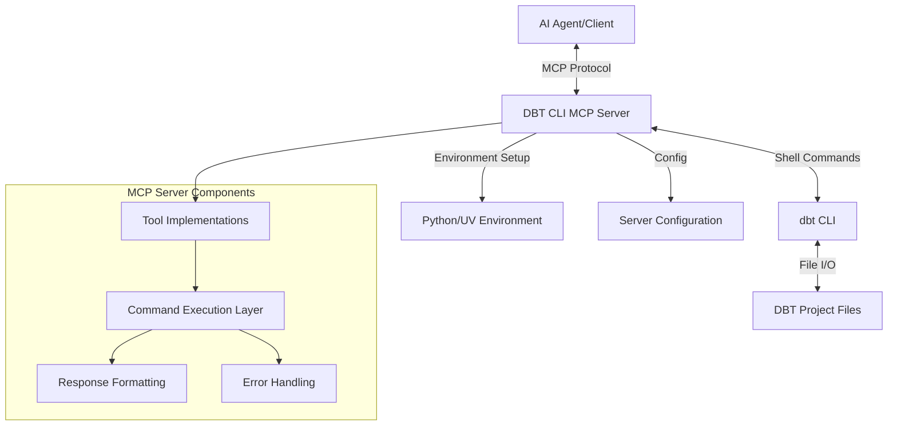

# DBT CLI MCP Server: Implementation Plan

## 1. Overview

This document outlines the architecture and implementation plan for a Model Context Protocol (MCP) server that wraps the dbt CLI tool. The server will enable AI coding agents to interact with dbt projects through standardized MCP tools, allowing them to perform operations like running models, testing, and analyzing dependencies.

## 2. Architecture

The DBT CLI MCP server will be built using Python with the FastMCP framework, providing a standardized interface between AI agents and the dbt command-line interface.



### Key Components:

1. **MCP Interface Layer**: Implements the Model Context Protocol, exposing dbt functionality as MCP tools.
2. **Command Execution Layer**: Handles the execution of dbt CLI commands in a subprocess.
3. **Result Parsing Layer**: Parses and formats the output from dbt commands into structured data for the agent.
4. **Error Handling Layer**: Manages and provides informative responses for execution errors.
5. **Environment Management**: Handles Python/uv environment setup and variable management.

## 3. Project Structure

The project will be organized into the following directory structure:

```
/Users/drew/Source/mcp-servers/dbt-cli-mcp/
│
├── pyproject.toml              # Project metadata and dependencies
├── README.md                   # Project documentation
├── .gitignore                  # Git ignore file
│
├── dbt_cli_mcp/                # Main package directory
│   ├── __init__.py             # Package initialization
│   ├── server.py               # MCP server implementation
│   ├── command.py              # Command execution utilities
│   ├── tools.py                # dbt tools implementation
│   └── config.py               # Configuration management
│
├── tests/                      # Test directory
│   ├── __init__.py             # Test package initialization
│   ├── test_command.py         # Command execution tests
│   ├── test_tools.py           # Tool implementation tests
│   └── test_server.py          # Server integration tests
│
└── examples/                   # Example usage and mock projects
    └── mock_responses/         # Mock dbt command responses for testing
```

## 4. Implementation Details

### 4.1 Core Module Structure

1. **`server.py`** - Main FastMCP server implementation that ties everything together
2. **`command.py`** - Responsible for handling command execution and output parsing
3. **`tools.py`** - Implements all MCP tool handlers that map to dbt CLI operations
4. **`config.py`** - Manages server configuration and environment setup

### 4.2 Core Functionality

The server will provide the following core functionality:

1. **Command Execution**: Execute dbt CLI commands with proper argument handling
2. **Output Processing**: Parse and format command outputs for client consumption
3. **Error Handling**: Detect and report errors in a structured format
4. **Configuration Management**: Handle server and environment configuration

### 4.3 MCP Tools

The server will implement the following MCP tools, each corresponding to a dbt CLI command:

1. **`dbt_run`**: Run dbt models
2. **`dbt_test`**: Run dbt tests
3. **`dbt_ls`**: List dbt resources
4. **`dbt_compile`**: Compile dbt models
5. **`dbt_debug`**: Debug dbt project setup
6. **`dbt_deps`**: Install dbt package dependencies
7. **`dbt_seed`**: Load CSV files as seed data
8. **`dbt_show`**: Preview model results
9. **`dbt_build`**: Run build command
10. **`configure_dbt_path`**: Configure dbt executable path

## 5. Testing Strategy

Since there's no actual dbt project in the folder yet, the testing strategy will focus on validating the basic functionality using mock responses.

### 5.1 Mock Testing Approach

1. **Mock Command Execution**: Create a system to mock dbt command execution and responses
2. **Response Fixtures**: Prepare sample responses for various dbt commands
3. **Parametrized Tests**: Test various command combinations and scenarios

### 5.2 Test Scenarios

1. **Basic Command Execution**: Verify command construction and execution
2. **Error Handling**: Test error detection and reporting
3. **Output Parsing**: Verify output parsing for different formats
4. **Tool Integration**: Test each tool handler independently
5. **MCP Protocol**: Test proper MCP protocol adherence

### 5.3 Running Tests

Tests will be run using `pytest` with the following commands:

```bash
# Install development dependencies
uv add -d pytest pytest-asyncio pytest-cov

# Run all tests
python -m pytest

# Run tests with coverage report
python -m pytest --cov=dbt_cli_mcp
```

## 6. Development Steps

Here are the step-by-step tasks for implementing the server:

### 6.1 Setup Project Structure

1. Create package structure and files
2. Configure development environment (pyproject.toml)
3. Set up testing infrastructure

### 6.2 Implement Core Components

1. Create mock command execution layer
2. Implement configuration management
3. Create basic error handling framework
4. Develop output parsing utilities

### 6.3 Implement MCP Tools

1. Create base tool implementation
2. Implement each dbt tool handler
3. Add input validation and error handling

### 6.4 Testing and Validation

1. Implement unit tests for each component
2. Create integration tests using mock responses
3. Validate MCP protocol compliance

### 6.5 Documentation

1. Create comprehensive README
2. Add tool and function documentation
3. Prepare example usage snippets

## 7. Instructions for Coder Agent

The coder agent should follow these steps to implement the project:

### 7.1 Environment Setup

```bash
# Ensure you're in the correct directory
cd /Users/drew/Source/mcp-servers/dbt-cli-mcp

# Set up the Python environment using uv
uv venv
source .venv/bin/activate

# Install dependencies
uv add mcp[cli] python-dotenv
uv add -d pytest pytest-asyncio pytest-cov

# Create project structure
mkdir -p dbt_cli_mcp tests/mock_responses examples
```

### 7.2 Implementation Order

1. Start by implementing `config.py` to handle configuration
2. Then implement `command.py` to handle command execution and mocking
3. Next, create the tool handlers in `tools.py`
4. Finally, implement the main server in `server.py`

### 7.3 Testing Instructions

```bash
# Run tests during development
python -m pytest -xvs tests/

# Run specific test file
python -m pytest -xvs tests/test_command.py

# Run with coverage
python -m pytest --cov=dbt_cli_mcp

# Generate coverage report
python -m pytest --cov=dbt_cli_mcp --cov-report=html
```

### 7.4 Running the Server

```bash
# Run the server using MCP development tools
mcp dev dbt_cli_mcp/server.py

# Or run directly
python -m dbt_cli_mcp.server
```

### 7.5 Validating the Implementation

To validate the implementation without an actual dbt project:

1. Use mock responses to ensure the server can parse and process different types of outputs
2. Validate that all tool handlers correctly construct dbt commands
3. Verify error handling works as expected
4. Test the server with the MCP Inspector tool

```bash
# Install MCP Inspector
npx @modelcontextprotocol/inspector

# Run the server with the Inspector
npx @modelcontextprotocol/inspector uv run dbt_cli_mcp/server.py
```

## 8. Detailed Implementation Guidelines

### 8.1 Configuration Management (`config.py`)

The configuration module should:

1. Define default configuration values
2. Support environment variable overrides
3. Allow runtime configuration changes
4. Validate configuration values

```python
# Sample configuration structure
DEFAULT_CONFIG = {
    "dbt_path": "dbt",
    "env_file": ".env",
    "log_level": "INFO",
    "mock_mode": False  # For testing without dbt installed
}
```

### 8.2 Command Execution (`command.py`)

The command module should:

1. Provide a clean interface for executing shell commands
2. Handle environment variables properly
3. Support command mocking for testing
4. Process and structure command outputs

```python
# Sample command execution interface
async def execute_dbt_command(
    command: List[str],
    project_dir: str = ".",
    mock_mode: bool = False,
    mock_response: Optional[Dict[str, Any]] = None
) -> Dict[str, Any]:
    """Execute a dbt command or return mock response for testing."""
    if mock_mode and mock_response:
        return mock_response
        
    # Real command execution logic...
```

### 8.3 Tool Implementation (`tools.py`)

Tool handlers should:

1. Validate input parameters
2. Construct proper command arguments
3. Execute commands using the command module
4. Format responses appropriately
5. Handle errors gracefully

```python
# Sample tool handler pattern
@mcp.tool()
async def dbt_run(
    models: Optional[str] = None,
    selector: Optional[str] = None,
    exclude: Optional[str] = None,
    project_dir: str = ".",
    full_refresh: bool = False,
    mock_mode: bool = False  # For testing
) -> str:
    """Run dbt models."""
    command = ["run"]
    
    # Add parameters...
    
    result = await execute_dbt_command(command, project_dir, mock_mode)
    
    # Process result...
```

### 8.4 Main Server (`server.py`)

The main server should:

1. Initialize the FastMCP instance
2. Register all tool handlers
3. Configure logging and error handling
4. Manage server lifecycle

```python
# Sample server initialization
mcp = FastMCP("dbt-cli")

# Import and register tools...

if __name__ == "__main__":
    # Initialize logging
    logging.basicConfig(
        level=getattr(logging, config["log_level"]),
        format='%(asctime)s - %(name)s - %(levelname)s - %(message)s'
    )
    
    # Run the server
    mcp.run()
```

## 9. Testing Without dbt

To test the server without an actual dbt installation, a mocking system should be implemented:

1. Create a `mock_responses` directory with JSON files representing dbt command outputs
2. Implement a mock command execution mode in `command.py`
3. Write tests that validate tool handlers using mock responses
4. Add a `mock_mode` flag to configuration to enable testing without dbt

Example mock response file (`tests/mock_responses/run_success.json`):

```json
{
  "success": true,
  "output": {
    "results": [
      {
        "status": "success",
        "model": "my_model",
        "execution_time": 1.5
      }
    ]
  },
  "error": null,
  "returncode": 0
}
```

## 10. Future Enhancements

1. **Extended Tool Set**: Add support for more dbt commands like `snapshot`, `source`, etc.
2. **Improved Output Parsing**: Enhanced parsing of dbt outputs for better structured responses.
3. **Caching Layer**: Implement caching to improve performance for repeated commands.
4. **Workspace Management**: Support for multiple dbt projects and workspaces.
5. **Progress Reporting**: Add support for long-running command progress reporting.
6. **Test Project**: Create a sample dbt project for thorough integration testing.
7. **Interactive Documentation**: Generate interactive tool documentation with examples.

## 11. Conclusion

This implementation plan provides a comprehensive approach to building an MCP server that wraps the dbt CLI. By following this architecture and development process, we will create a robust bridge between AI coding agents and dbt, enabling automated data transformation workflows and analytics.

The server will be tested extensively using mock responses initially, with the capability to test against real dbt projects once they are available. The modular design ensures that components can be developed and tested independently, leading to a more maintainable and extendable codebase.